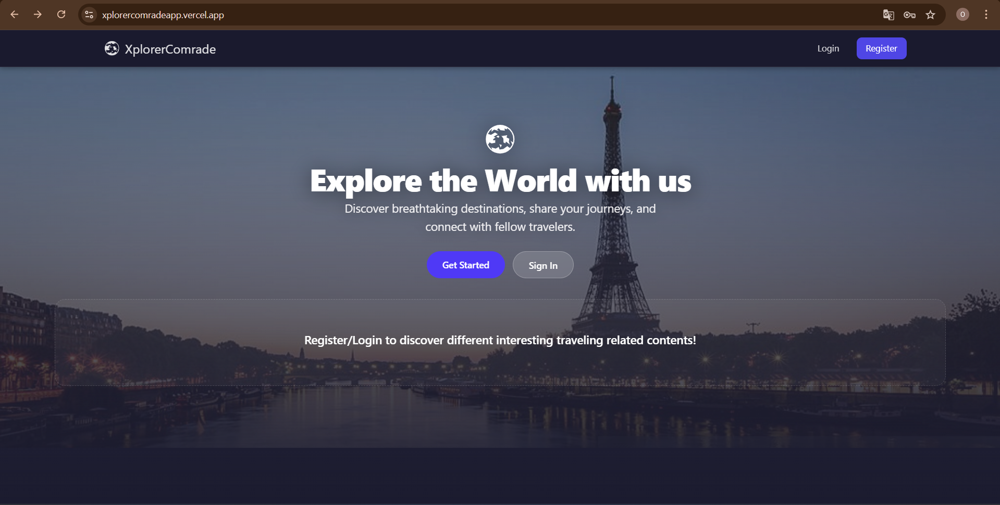
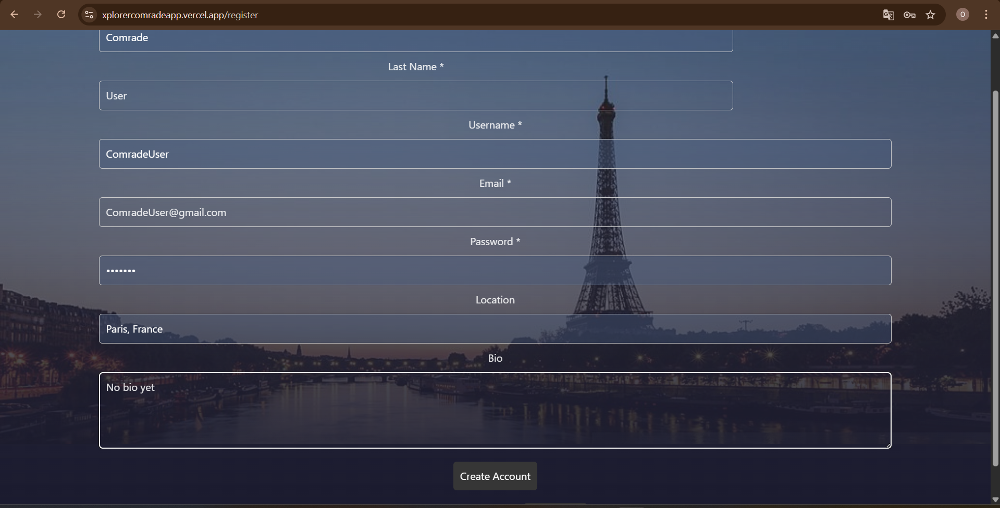
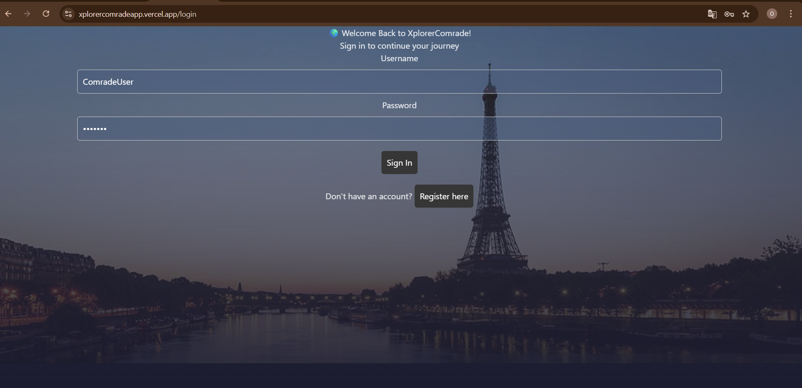
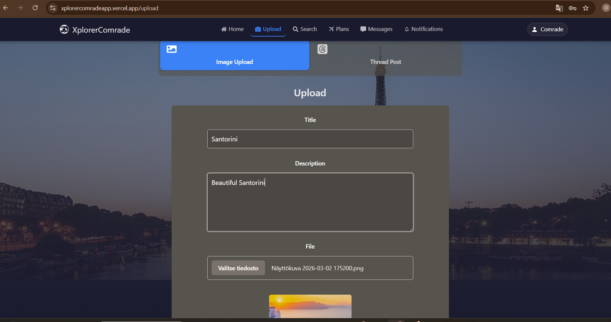
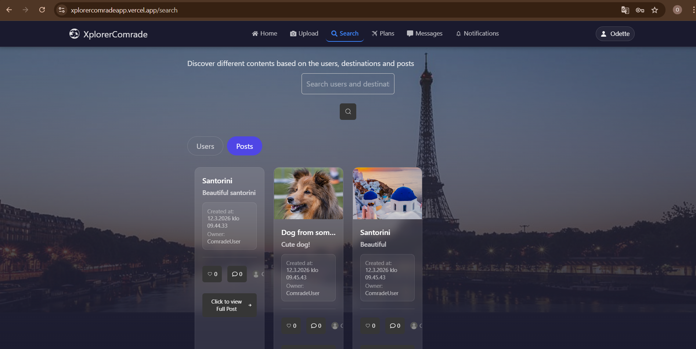
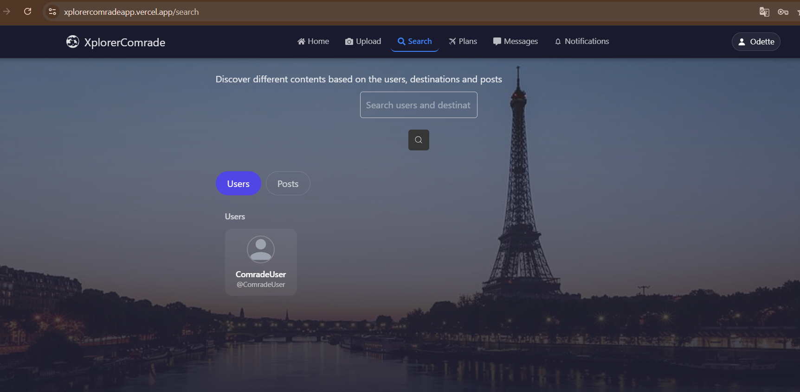
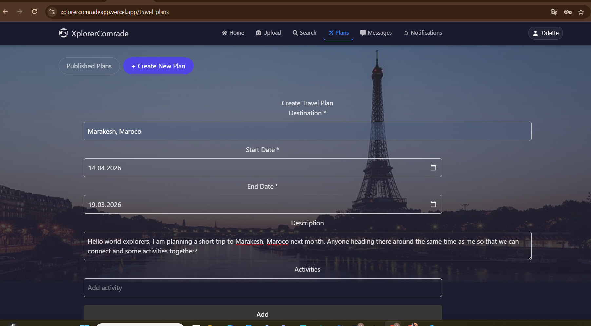
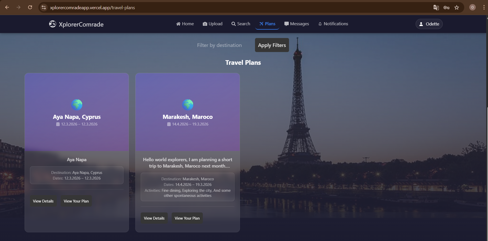
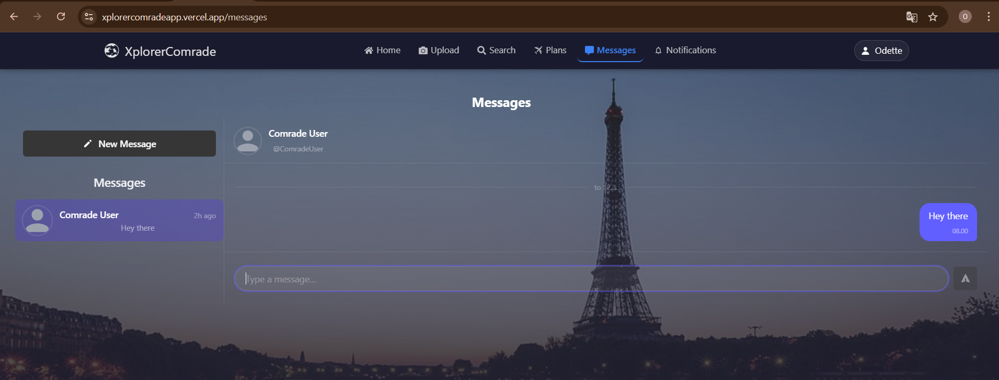
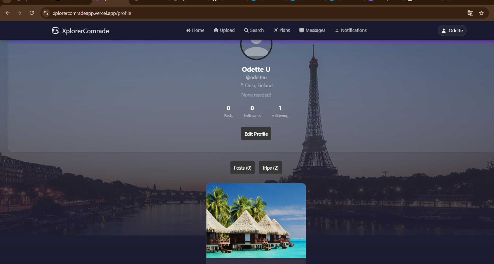

# XplorerComrade

A social travel app for finding travel companions, sharing experiences, and exploring the world with people who share the same destinations and interests.

## Links
### Video tallenne: 
- **Teams tallenne:** [UI video](https://teams.cloud.microsoft/l/meetingrecap?driveId=b%21NFwLIJkyr0iKFVutsqxi3vsIvbSXGvRHtIPDeztGMyNo1nw4nS8bRpP3cSfKcQGS&driveItemId=01MS6YOZPJ3IZEJQVG5BH2XMOPQLEGR5HS&sitePath=https%3A%2F%2Fmetropoliafi.sharepoint.com%2Fsites%2FMine_00e80f%2FJaetut+asiakirjat%2FGeneral%2FRecordings%2FKokous+kanavalla+General-20260312_103437-Kokouksen+tallenne.mp4%3Fweb%3D1&fileUrl=https%3A%2F%2Fmetropoliafi.sharepoint.com%2Fsites%2FMine_00e80f%2FJaetut+asiakirjat%2FGeneral%2FRecordings%2FKokous+kanavalla+General-20260312_103437-Kokouksen+tallenne.mp4%3Fweb%3D1&threadId=19%3Ajn68XhO8QyA6xb-CIKKM3yav4Kv6VEz67_BRHFasLG01%40thread.tacv2&organizerId=c7bfa63e-e618-40f0-8350-2da03f9bf146&tenantId=4d1a61d7-b6a5-4f64-8787-f074f87013ee&callId=89370f3f-8b18-41c5-abd3-63177a86f125&threadType=space&meetingType=MeetNow&organizerGroupId=1c30cc8e-6105-48cf-8f0c-4a24ea77df00&channelType=Standard&replyChainId=1773304426335&subType=RecapSharingLink_RecapCore)

- **Frontend (live app):** https://xplorercomradeapp.vercel.app
- **GitHub repo:** https://github.com/OdetteU23/XplorerComradeProject
- **Auth API:** https://xcomrade-auth-wabq.onrender.com/api
- **MediaContent API:** https://xcomrade-mediacontent-wabq.onrender.com/api
- **Upload API:** https://xcomrade-upload-wabq.onrender.com/api

## API Documentation (apidoc)

- **Auth server apidoc:** https://xcomrade-auth-wabq.onrender.com/apidocs
- **MediaContent server apidoc:** https://xcomrade-mediacontent-wabq.onrender.com/apidocs
- **Upload server apidoc:** https://xcomrade-upload-wabq.onrender.com/apidocs

## Test User Credentials

| Field | Value |
|---|---|
| Name | Comrade User |
| Username | @ComradeUser |
| Password | 1234567 |

## Screenshots käyttöliittymästä:

**Julkinen kotisivu:** 

**Rekisteröitymis- ja kirjautumisnäkymä:**   

**Login:** 

**Kotisivu kirjautunut käyttäjälle:** 

**Uploadnäkymä:** 

**Estinäkymä:**  
**Etsi näkymä:** 
**Matkasuunnittelu näkymä:** 
**Plans:** 
**Viesti näkymä:** 
**Käyttäjän profiili näkymä:** 

## Database Description
**Find the database description in the backend Readme: [XComrade-backend/ReadMe.md](XComrade-backend/ReadMe.md)**

## Implemented Features

1. **User management & authentication** — Register, login, profile management with JWT tokens. Passwords hashed with bcrypt. (`auth-server`)

2. **Feed & posts** — Feed of followed users posts, random/explore posts, search, and trending posts. Guests see limited content. (`mediaContent-server`)

3. **Like system** — Like/unlike with optimistic UI updates (Zustand + useReducer). State synced in real time across components.

4. **Comments** — Add, display, and delete comments on posts. Thread-style format.

5. **Follow system** — Follow/unfollow users, list followers and following, check follow status. (`auth-server`)

6. **Real-time messages** — Two-way chat with WebSocket, typing indicators, message history, and read receipts. (`mediaContent-server: websocket.ts`)

7. **Notification system** — Notifications for likes, comments, follows, messages, and buddy requests. Toast notifications in real time.

8. **Travel plans** — Create travel plans (destination, dates, activities, budget), search, filter, and manage them.

9. **Travel buddy system** — Send buddy requests to travel plans, accept/reject, track participants.

10. **Media file management** — Upload images/videos with multer, store files in SQLite as BLOBs for persistence, user-specific delete permissions. (`upload-server`)

11. **UI** — Responsive SPA (React + Vite + Tailwind), protected routes, mobile and desktop navigation, form validation, loading states, error handling.

12. **Shared type library** — Common TypeScript type module (`@xcomrade/types-server`) for frontend and all backends — ensures type-safe data transfer throughout the architecture.

## Known Bugs / Issues

1. **Data resets on redeploy** — SQLite is stored in `/tmp` on Render free tier. All user data is wiped on every redeploy or service restart. Users need to re-register after each restart.

2. **Folder rename deployment bug** — Early in the project folder names were changed (`XplorerComrade-backend-server` to `XComrade-backend` etc.). This caused Azure deployment failures even though all CI/CD tests passed. See [palautusMD/Bugit.md](palautusMD/Bugit.md).

3. **Upload 500 on post creation** — Creating posts with media returned 500 errors due to orphaned SQLite WAL files committed to git. Fixed: WAL files removed, `DB_PATH` set to `/tmp`.

4. **Cold starts on Render free tier** — Services spin down after 15 min of inactivity. First request after idle takes 30-60 seconds.

## Tech Stack

- **Backend:** Find the backend's Tech Stack in [XComrade-backend/ReadMe.md](XComrade-backend/ReadMe.md)
- **Frontend:** React + Vite + TypeScript + Tailwind CSS + Zustand + React Router
- **Shared types:** `@xcomrade/types-server` TypeScript module (npm workspaces monorepo)
- **Deployment:** Frontend on Vercel, 3 backend servers on Render.com (Frankfurt)

---

*Made with love for travelers who love to explore and connect*
