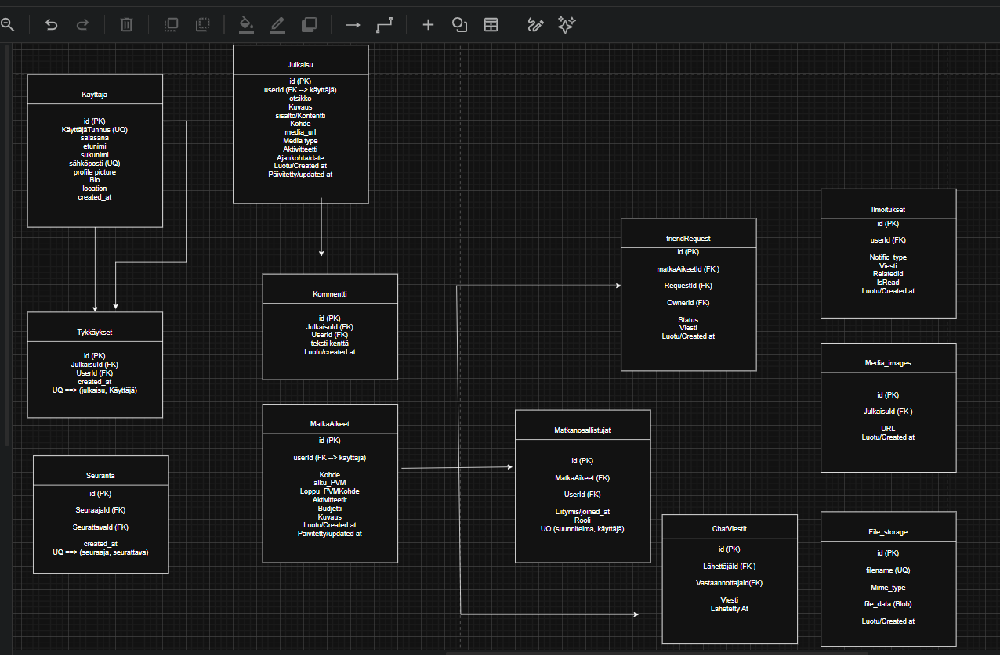

# (XComrade) XplorerComrade --> Backend API

A multi-server Express.js backend for the XplorerComrade travel companion app. Built with TypeScript, SQLite (better-sqlite3), and JWT authentication.

---

## Live Backend --> Azure

| Server | URL |
|--------|-----|
| **auth-server** | `https://xplorercomrade-auth.azurewebsites.net/api` |
| **mediaContent-server** | `https://xplorercomrade-media.azurewebsites.net/api` |
| **upload-server** | `https://xplorercomrade-upload.azurewebsites.net/api` |

> Replacing the URLs above with the actual Azure App Service URLs once deployed.

---

## API Documentation ==> apiDoc

Interactive HTML documentation generated with [apiDoc](https://apidocjs.com/). Each server serves its own docs:

| Server | API Docs URL |
|--------|--------------|
| **auth-server** | `https://xplorercomrade-auth.azurewebsites.net/apidocs` |
| **mediaContent-server** | `https://xplorercomrade-media.azurewebsites.net/apidocs` |
| **upload-server** | `https://xplorercomrade-upload.azurewebsites.net/apidocs` |

**Local development:**
- auth-server: http://localhost:3000/apidocs
- mediaContent-server: http://localhost:3001/apidocs
- upload-server: http://localhost:3002/apidocs

**Regenerate docs:**
```bash
cd auth-server && apidoc -i src -o apidocs
cd ../mediaContent-server && apidoc -i src -o apidocs
cd ../upload-server && apidoc -i src -o apidocs
```

---

## Database Description

All three servers share a single **SQLite** database file (`XComrade.sqlite`) using WAL mode for concurrent read access.

### ER Diagram

```


### Tables Summary

| Table | Description | Key Relationships |
|-------|-------------|-------------------|
| **käyttäjä** | User accounts with profile info | Central entity — referenced by most other tables |
| **julkaisu** | User posts with media and location | `userId → käyttäjä.id` |
| **tykkäykset** | Post likes (unique per user+post) | `julkaisuId → julkaisu.id`, `userId → käyttäjä.id` |
| **kommentti** | Post comments | `julkaisuId → julkaisu.id`, `userId → käyttäjä.id` |
| **seuranta** | Follow relationships between users | `seuraajaId → käyttäjä.id`, `seurattavaId → käyttäjä.id` |
| **matkaAikeet** | Travel plans with dates, activities, budget | `userId → käyttäjä.id` |
| **friendRequest** | Buddy requests for travel plans | `matkaAikeetId → matkaAikeet.id`, `requesterId/ownerId → käyttäjä.id` |
| **tripParticipants** | Confirmed trip participants | `matkaAikeetId → matkaAikeet.id`, `userId → käyttäjä.id` |
| **chatMessages** | Direct messages between users | `senderId/receiverId → käyttäjä.id` |
| **notifications** | In-app notifications (likes, comments, etc.) | `userId → käyttäjä.id` |
| **media_images** | Additional images attached to posts | `julkaisuId → julkaisu.id` |
| **file_storage** | Binary file storage for uploads (DB fallback) | Standalone — stores file blobs when disk is unavailable |

---

## Server Architecture

```
XComrade-backend/
├── auth-server/        (port 3000)  Authentication, users, follows
├── mediaContent-server/ (port 3001) Posts, comments, likes, travel plans, messages, notifications, WebSocket
├── upload-server/       (port 3002) File upload/delete with disk + DB storage
└── XComrade.sqlite                  Shared database (WAL mode)
```

All servers share the same SQLite database. Each server initializes its own connection with `journal_mode = WAL` for concurrent reads.

---

## CI/CD

GitHub Actions workflow (`.github/workflows/ci-test-env.yml`):

1. **Push to `test-env`** — CI runs (install, tests) for all 3 servers + frontend build
2. **CI passes** — merge/PR to `main`
3. **Push to `main`** — CI re-validates merged code
4. **Manual trigger** — deploy to Azure Function Apps (Actions tab → Run workflow)

---

## Tech Stack

- **Runtime:** Node.js 20, TypeScript
- **Framework:** Express.js
- **Database:** SQLite via better-sqlite3 (WAL mode)
- **Auth:** JWT (jsonwebtoken) + bcryptjs
- **Real-time:** WebSocket (ws) on mediaContent-server
- **File uploads:** Multer (disk storage) + SQLite BLOB fallback
- **Testing:** Vitest + Jest (83 tests across 3 servers)
- **Docs:** apiDoc
- **CI/CD:** GitHub Actions → Azure App Service
