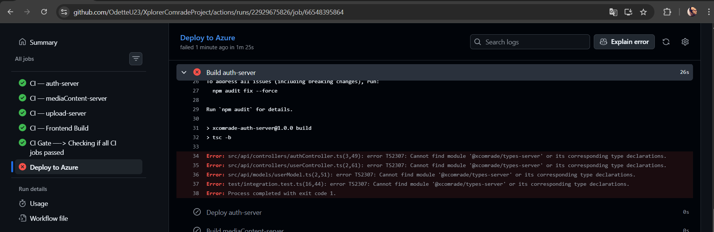
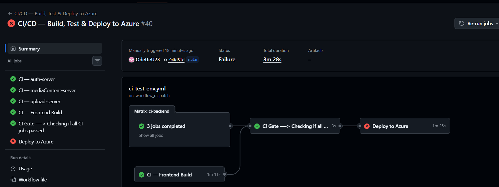

# Bugit
### 1)

## Why this bug?
  - At the begining of this project the project's folders were: -XplorerComrade-fontend-server
  -XplorerComrade-backend-server
  -XplorerComrade-hybrid-types-server
- ==> which later on looked way too long, so I decided to change the folders to:
-XComrade-frontend
-XComrade-backend
-XComrade-hybrid-types
- After changing the name I fixed what needed to be fixed in the package Jsons and
the fixes took place.
- All CD/CI jobs passed the test , but the bug kept occurreing on Azure deployment. Took a while to fix.
